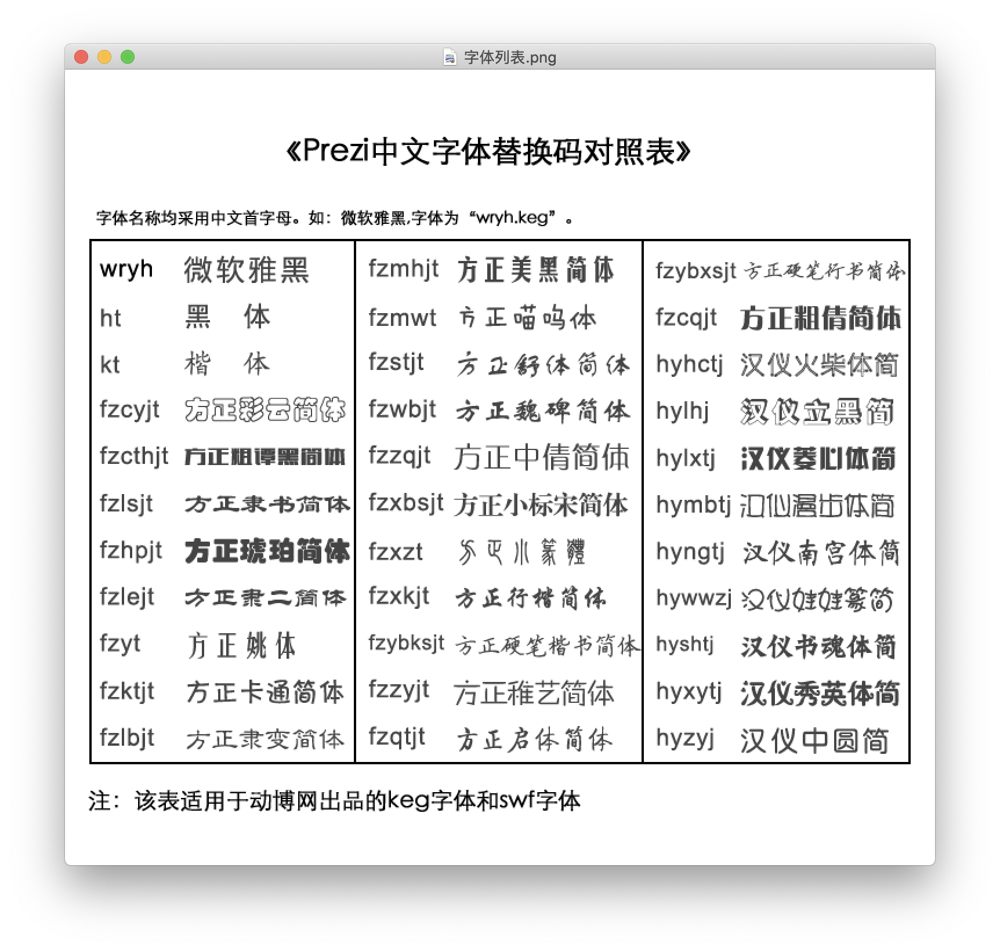

# 为 Prezi Desktop 添加中文字体

下载安装 Prezi Desktop Classic。

将 .keg 字体文件拷贝到：

> ```~/Library/Application Support/com.prezi.PreziDesktop/resources/fonts```

此仓库中的 .keg 字体下载自：

> http://www.itmop.com/downinfo/129198.html

以防万一以后找不到，所以在此仓库做了个 “备份”。

新建 Prezi Presentation，在设置里将 ```Enable Shotcuts``` 打开，设置为 ```On```：


而后就可以使用 shift + command + c 打开样式编辑器（其实是 css）：


字体文件对应的字体如下：

